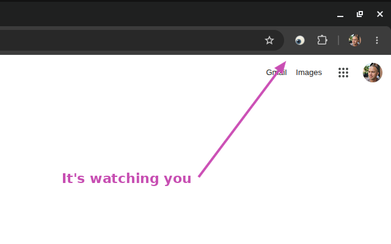

# Eyeball - a curious eye in your toolbar



A tiny Chrome extension (Manifest V3) that puts a **single eye** in your
toolbar. The pupil tracks your cursor on the active page. On pages it can't
read (PDFs, the Chrome Web Store, `chrome://` pages), the eye centers. No
network, no tracking.

## Features

- **Single-eye toolbar icon** that follows the cursor on the active page.
- **Holds the last pose** when the cursor stops on a supported tab, and
  **centers** when the active tab is unsupported (PDF viewer, internal Chrome
  pages, the Web Store).
- **Sleeping eye** when the browser window loses focus.
- **Spontaneous blinks** every 7-13 seconds while the eye is actively
  tracking, plus a soft heartbeat blink about once a minute. Clicking the
  icon also blinks it.
- **No popup, no UI surface beyond the toolbar icon.** This is a pure
  toolbar experiment.
- **No network, no analytics, no accounts, no tracking.** Cursor coordinates
  are converted to an angle and distance on-device and used only to pick
  which pre-rendered sprite to show.

## Why a single eye

The toolbar icon is 16 px at standard density. Two eyes side by side give
each eye only ~7 px - the pupil can move maybe one pixel, which doesn't read
as tracking. One eye keeps enough pupil travel that the motion is clearly
intentional, and it makes a stronger logo.

## Install from source

1. Generate the icons: `npm run icons`
2. Open `chrome://extensions` in Chrome.
3. Enable "Developer mode" (top right).
4. Click "Load unpacked" and select the project folder.
5. Move your cursor on any tab - the toolbar eye should follow it.

## How it works

At install time, the service worker pre-renders 18 eye sprites (16
directional pupil positions + a centered pose + a closed pose) at 16 px and
32 px, caching each as `ImageData`. A content script on every page throttles
`mousemove` to ~10 Hz, converts each cursor position to a viewport-relative
`(angle, magnitude)` pair, and sends it over a long-lived
`chrome.runtime.connect` Port. The service worker maps the angle to one of
the 16 buckets and calls `chrome.action.setIcon({ imageData })` - but only
when the bucket actually changes, and never more often than ~25 Hz.

The brand icon (`icons/icon{16,32,48,128}.png`) is generated analytically by
`scripts/make-icons.mjs` with no external dependencies - a small PNG
encoder built on Node's `zlib`.

## States

| State      | Trigger                                                                                          | Behavior                                                                                                            |
| ---------- | ------------------------------------------------------------------------------------------------ | ------------------------------------------------------------------------------------------------------------------- |
| `open`     | Default - the active tab has a connected content script                                          | Pupil follows the cursor; freezes at the last pose when the cursor stops; centers when the active tab is unsupported (PDF, `chrome://`, Web Store) |
| `sleeping` | Browser window unfocused                                                                         | Eye closed                                                                                                          |
| `blinking` | Spontaneous (every 7-13 s while tracking), a soft heartbeat about once a minute, and toolbar-icon click | Brief eye-closed frame, then back to the last pose                                                                  |

## Permissions

| Permission         | Why it is needed                                                                                   |
| ------------------ | -------------------------------------------------------------------------------------------------- |
| `alarms`           | Periodic soft blink.                                                                               |
| `<all_urls>` (host)| Lets the content script read cursor position on the active page so the eye can follow it.         |

Eyeball reads only `mousemove` coordinates from the active page. It does not
read page content, form data, URLs, history, cookies, or anything else. See
[PRIVACY.md](PRIVACY.md).

## Development

```sh
npm test     # runs the eye.js unit tests (node --test)
npm run icons  # regenerates icons/*.png
npm run package  # builds dist/eyeball-v<version>.zip for the Chrome Web Store
```

## License

[Apache-2.0](LICENSE). Copyright 2026 Konstantin Komelin.
